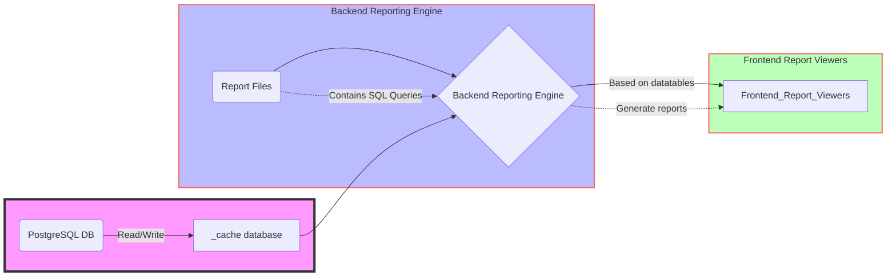

QuickRep Reporting Engine Overview
========

An advanced PHP reporting engine designed for optimal performance with Laravel, developed by [Owlookit Systems](https://owlookit.com)

Architecture Overview
------------------

At its core, Quickrep operates by executing your SQL queries against your dataset and then transferring the results into a cache table (typically within the \_quickrep database). It then performs paging and sorting operations on this cached dataset.  
